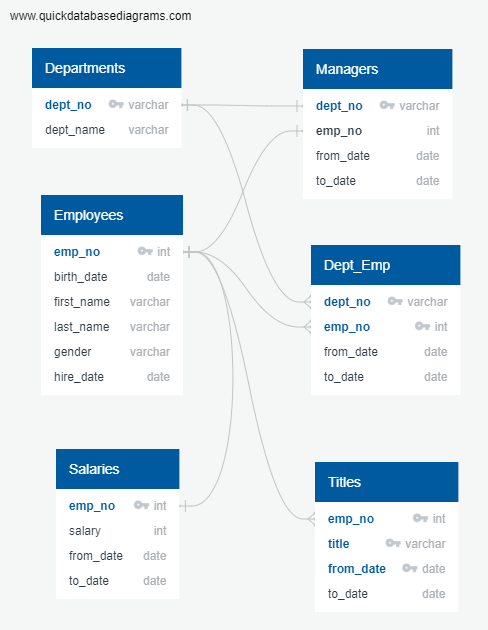

# Pewlett-Hackard-Analysis

## Problem
- Our task was to:
  - Determine the total number of employees per title who will be retiring.
  - Identify employees who are eligible to participate in a mentorship program.

## Summary
### Solving the Problem
---

---
  First, tables were created from the above six data files.  Next, the data was queried to find the number and names of the job titles.  Then, a table was created to find the employees about to retire grouped by job title.  Two INNER JOINs were used ON employee numbers from employees data, titles data, and salaries data WHERE employee birthdates were between 1-1-1952 and 12-31-1955 and grouped by title.  We encountered the problem of duplicate names as the table was ordered by employee number to find duplicates based on changes in job title.  Next, the data was partitioned to remove duplicates leaving only the most recent job title in the table.  The table was then grouped by job title to show the number of retirees by title.
  
  For the mentorship program data, a table showing mentorship eligibility was created using INNER JOIN on the employees and titles data ON employee number WHERE birth dates were between 1-1-1965 and 12-31-1965.  The problem again arose of duplicate names due to job title changes.  This data was then partitioned to remove all but the most recent job title for each employee by employee number.  Next, the data was queried to produce the total number of employees eligible for the mentorship program.

## Results
  - It was found that the total number of employees per title who will be retiring are as follows:
    - Engineers - 14,222
    - Senior Engineers - 29,414
    - Managers - 2
    - Assistant Engineers - 1,761
    - Staff - 12,242
    - Senior Staff - 28,255
    - Technique Leaders - 4,502

  - Additionally, the number of employees eligible to participate in a mentorship program are:
    - Mentorship Eligible - 1,940

### Limitations & Recommendations
  - It may be beneficial to query those employees born between 1-1-1956 and 12-31-1964 to determine mentorship interest and possibly early retirement interest.  There is a large gap of employees based on birthdate that are not accounted for. 
